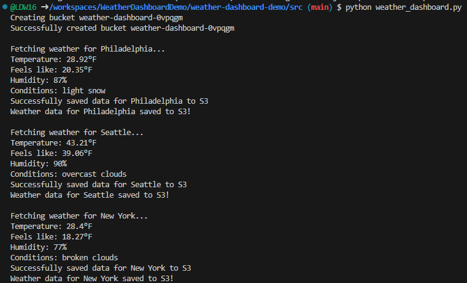

# Weather Dashboard Demo - AWS

## Project Guidelines provided by SHAEINTHECLOUD:
[Watch the Tutorial](https://www.youtube.com/watch?v=A95XBJFOqjw)

### Sample Output:


This project is a Weather Data Collection System built using Python, AWS S3, and the OpenWeather API. It fetches, stores, and manages real-time weather data while showcasing core DevOps principles, Python development, and cloud integration skills.

---

## Project Overview

The Weather Dashboard demonstrates:
- **API Integration**: Real-time weather data retrieval using the OpenWeather API.
- **Cloud Storage**: Secure storage of weather data in AWS S3 buckets.
- **Environment Management**: Configurable with environment variables for sensitive information like API keys and bucket names.
- **DevOps Principles**: Simplified deployment and cloud integration.

---

## Key Features

- **Real-Time Weather Data**: Fetches up-to-date weather information for multiple cities.
- **Detailed Insights**: Displays temperature (°F), humidity levels, and current weather conditions.
- **Cloud Storage Integration**: Automatically saves weather data to AWS S3 buckets for secure storage.
- **Bucket Name Randomization**: Attaches a unique tag to the base bucket name.
- **Multi-City Monitoring**: Tracks weather conditions for various cities simultaneously.

---

## Technical Architecture

- **Language**: Python 3.x
- **Cloud Provider**: AWS (S3)
- **External API**: OpenWeather API

### Core Dependencies

- `boto3`: AWS SDK for Python.
- `python-dotenv`: For managing environment variables.
- `requests`: Simplified HTTP requests for API integration.

---

## Project Structure

```
weather-dashboard/
  ├── src/
  │   ├── __init__.py
  │   └── weather_dashboard.py
  ├── tests/
  ├── data/
  ├── .env
  ├── .gitignore
  ├── requirements.txt
```

---

## Setup

### 1. Clone the Repository (Optional)

If you prefer to recreate the structure manually (as I did for learning), follow these steps:
- Create all the files and directories listed in the Project Structure above.
- Populate the files with the required content.

Alternatively:
```bash
git clone <repository-url>
cd weather-dashboard
```

### 2. Create a Virtual Environment (Optional)

Set up an isolated Python environment:
```bash
python3 -m venv env
source env/bin/activate  # Activate the environment
```
**Note**: Step 2 may be optional depending on the tools used. I used GitHub tools/terminal for this project and was able to move directly from Step 1 to Step 3.

### 3. Install Dependencies

Install the required Python libraries:
```bash
pip install -r requirements.txt
```

### 4. Configure Environment Variables

Create a `.env` file in the root directory:
```
OPENWEATHER_API_KEY=your_openweather_api_key
AWS_BUCKET_NAME_BASE=your_s3_bucket_name
AWS_ACCESS_KEY_ID=your_aws_access_key_id
AWS_SECRET_ACCESS_KEY=your_aws_secret_access_key
```
**Note**: I used the AWS Toolkit extension for AWS connectivity and included the `key_id` and `secret_access_key` in my `.env` file. This information should be hidden or removed after successful completion.

### 5. Configure AWS Credentials (Optional)

Set up AWS CLI credentials:
```bash
aws configure
```
You will need:
- **Access Key ID**
- **Secret Access Key**
- **Default region** (e.g., `us-east-1`)

### 6. Run the Application

Execute the script to fetch and save weather data:
```bash
python src/weather_dashboard.py
```

---

## Common Issues

1. **Bucket Name Issues**: Ensure the bucket name in `.env` is valid and unique.
2. **AWS Credentials Error**: Verify AWS CLI is properly configured and has sufficient permissions.
3. **OpenWeather API Key Error**: Check if your API key is active and correctly entered in `.env`.
4. **Missing Dependencies**: Ensure all required libraries are installed.
5. **Access Denied to Run .py**: Change file access permissions:
   ```bash
   chmod +x filename.py
   ```
6. **AWS Access/Credentials Not Found**: Ensure your AWS user or role has S3 permissions (see Step 4).
7. **CloudFormation Access Error**: Create an inline policy to address this issue:
   ```json
   {
     "Version": "2012-10-17",
     "Statement": [
       {
         "Effect": "Allow",
         "Action": "cloudformation:ListStacks",
         "Resource": "*"
       }
     ]
   }
   ```

---

## Learning Goals

This project is part of a 30-day DevOps challenge aimed at mastering:
- Python scripting.
- Cloud integration with AWS.
- API consumption and data handling.
- Error handling and debugging.
